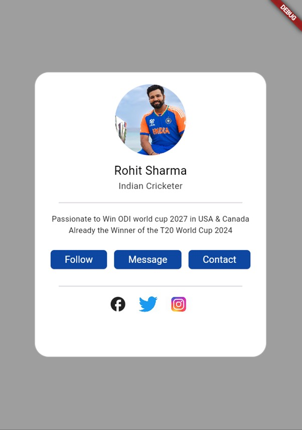
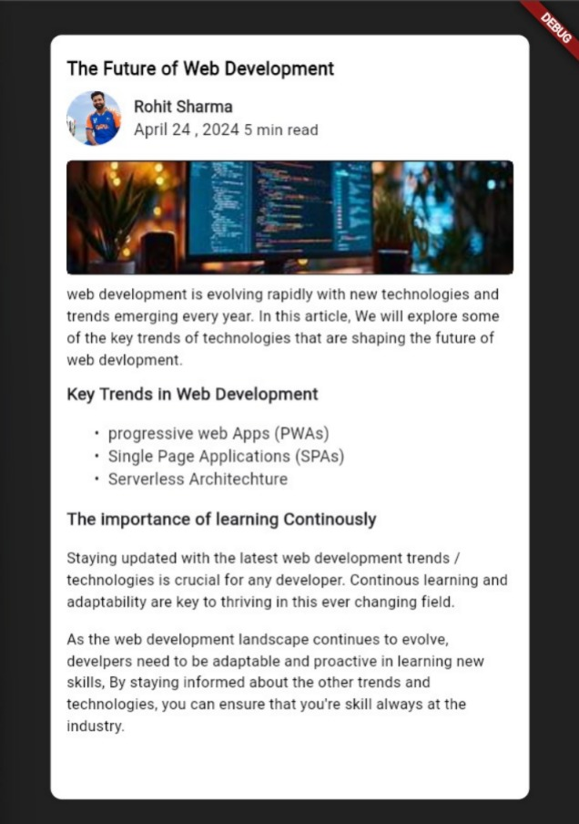
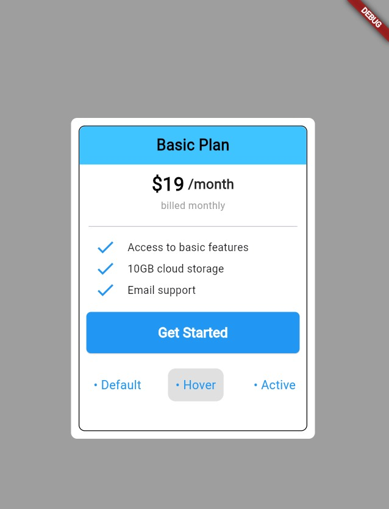
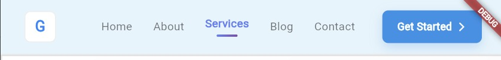

# Flutter Practice 🚀

A structured **30 Days Flutter UI Practice** project focused on building beautiful and reusable UI components step by step.

---

## 📌 Project Overview
This repository documents my **daily Flutter UI practice**, where each day focuses on creating a new screen or component using Flutter.  
The goal is to improve UI skills, layout understanding, and Flutter widget mastery.

---

## 🛠 Tech Stack
- **Flutter**
- **Dart**
- **Material UI**

---

## 📅 Progress Tracker (30 Days)

### ✅ Day 1 – Basic UI Layout


---

### ✅ Day 2 – Login Screen Design


---

### ✅ Day 3 – Profile Screen UI


---

### ✅ Day 4 – Simple Navbar 



---

## 🎯 Goal
- Build **30 different Flutter UI screens**
- Practice responsive layouts
- Improve widget composition
- Maintain clean and readable code

---

## 📂 Folder Structure
```text
flutter_practice/
├── assets/
│   ├── day1.jpg
│   ├── day2.jpeg
│   ├── day3.jpeg
│   └── ...
├── lib/
│   └── main.dart
└── README.md
